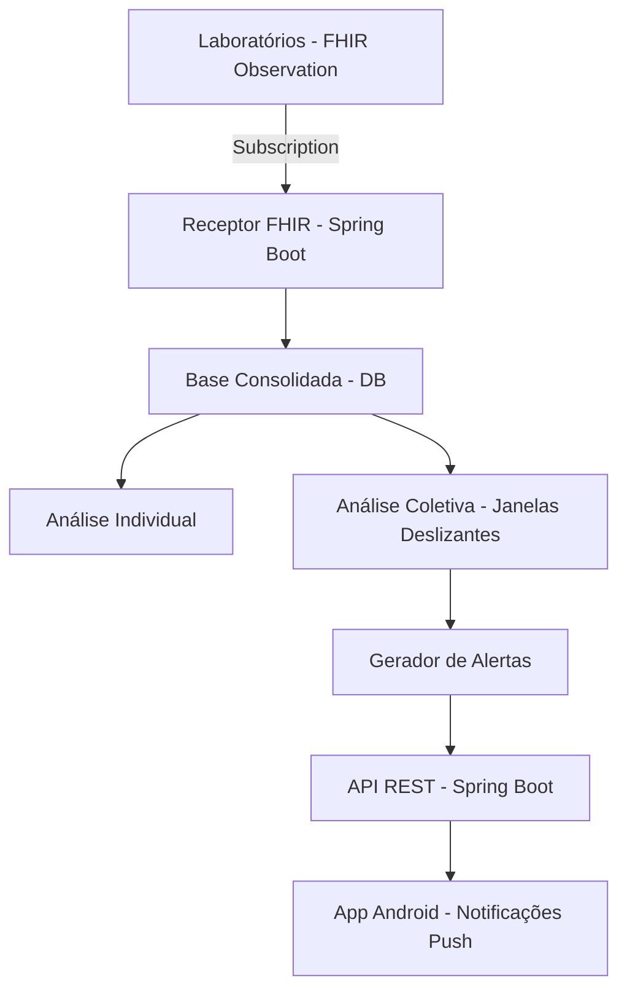

# 📊 Sistema de Monitoramento de Hemogramas

Projeto desenvolvido para a disciplina **Software para Sistemas Ubíquos**, com objetivo de implementar um sistema capaz de receber, processar e analisar hemogramas em tempo real, detectando anomalias individuais e coletivas e notificando gestores de saúde pública.

---

## 👥 Integrantes da Equipe

-   👨‍💻 [Mikael Borges de Oliveira e Silva Junior] - [202201708]
-   👨‍💻 [Samuel Jose Evangelista Alves] - [202201712]
-   👨‍💻 [Vitor Martins Castanheira] - [202201717]
-   👨‍💻 [Guilherme Gonçalves Dutra de Mendonça] - [202201692]
-   👨‍💻 [Leonardo Ribeiro Oliveira Palmeira] - [202201701]
-   👨‍💻 [Frederico Garcêz Rodrigues] - [202201690]


---

## 🚀 Objetivo
Permitir que gestores de saúde recebam, em tempo real, **alertas baseados em evidências laboratoriais populacionais**, a partir de hemogramas enviados por laboratórios da rede estadual.

---

## 📌 Caso específico de uso
https://docs.google.com/document/d/1nZMXgcjBi-CoS1EIFbuKScNUfYbSLRIFcHnM_TwVv_Q/edit?tab=t.0#heading=h.7azzr1pwqi8c

---

## 🏗️ Arquitetura Geral
O sistema será composto por:

- **Receptor FHIR**: Recepção de hemogramas via mecanismo de subscription (FHIR R4, recurso `Observation`).  
- **Análise Individual**: Detecção de desvios hematológicos com base em valores de referência.  
- **Base Consolidada**: Armazenamento local dos hemogramas recebidos.  
- **Análise Coletiva**: Identificação de padrões anômalos populacionais em janelas deslizantes.  
- **API REST**: Disponibilização dos alertas gerados.  
- **Aplicativo Móvel (Android)**: Notificação push e consulta de alertas.  

---

## 📅 Marcos Técnicos

### 🔹 Marco 1 – Recepção FHIR
- Implementação do receptor de mensagens FHIR via subscription.  
- Parsing de instâncias do recurso **Observation (hemograma)**.  
- Exemplo de servidor de testes: [HAPI FHIR R4](https://hapi.fhir.org/baseR4/).  
---

### 🔹 Marco 2 – Análise Individual
- Componente de análise individual de hemogramas.  
- Detecção de desvios nos parâmetros hematológicos segundo tabela de referência:  

| Parâmetro   | Unidade | Valor Mínimo | Valor Máximo |
|-------------|---------|--------------|--------------|
| Leucócitos  | /µL     | 4.000        | 11.000       |
| Hemoglobina | g/dL    | 12.0         | 17.5         |
| Plaquetas   | /µL     | 150.000      | 450.000      |
| Hematócrito | %       | 36           | 52           |

- Qualquer valor fora da faixa será registrado como **alerta individual**.

---

### 🔹 Marco 3 – Base Consolidada
- Persistência dos hemogramas recebidos.  
- Estrutura de dados otimizada para consultas em janelas de tempo.  
- Banco de dados sugerido: **PostgreSQL** ou **MongoDB**.  

---

### 🔹 Marco 4 – Análise Coletiva
- Detecção de **padrões populacionais anômalos** em janelas deslizantes (ex.: últimas 24h).  
- Indicadores computados:  
- Total de hemogramas recebidos.  
- Proporção de exames com alertas individuais.  
- Média e desvio padrão dos parâmetros.  
- Tendência temporal (comparação com janela anterior).  
- Gatilhos para alerta coletivo:  
- Número mínimo de hemogramas.  
- Proporção de alertas acima do limiar configurado.  
- Aumento significativo em relação à janela anterior.  

---

## 🛠️ Tecnologias utilizadas (sujeito a mudanças)
- **Backend**: FastAPI (Python)
- **FHIR**: fhir.resources (Python)
- **Banco de Dados**: PostgreSQL
- **API REST**: FastAPI
- **Visualização**: Leaflet.js + Leaflet.heat
- **App Mobile**: React Native ou Flutter (planejado)
- **Notificações Push**: Firebase Cloud Messaging (planejado)
- **Containerização**: Docker + Docker Compose

---

## 🗺️ Mapa de Calor em Tempo Real

O sistema inclui uma visualização interativa em mapa de calor que mostra todos os casos de hemogramas registrados em tempo real.

### Como Usar

1. Inicie o sistema:
```bash
cd application
docker-compose up --build
```

2. Acesse o mapa de calor no navegador:
```
http://localhost:8000
```

### Funcionalidades

- **Visualização Geográfica**: Mapa de calor mostrando distribuição de casos
- **Intensidade por Leucócitos**: Cores indicam níveis de leucócitos (azul=baixo, vermelho=alto)
- **Marcadores Interativos**: Clique nos pontos para ver detalhes do caso
- **Atualização Automática**: Dados atualizados automaticamente a cada 30 segundos
- **Estatísticas em Tempo Real**: Total de casos e horário da última atualização

Para mais detalhes, consulte [MAPA_CALOR.md](MAPA_CALOR.md)

---

## 📲 Fluxo do Sistema


## 📌 Status do Projeto (Cronograma)

| Sprint | Período        | Entregas Principais                                      | Status |
|--------|----------------|----------------------------------------------------------|--------|
| Sprint 1 | Setembro/2025 | Marco 1 – Recepção FHIR (Subscription + Parsing)      | ✅ Concluído |
| Sprint 2 | Outubro/2025  | Marco 2 – Análise Individual (detecção de desvios)    | ✅ Concluído |
| Sprint 3 | Novembro/2025 | Marco 3 – Base Consolidada (persistência dos dados)   | ✅ Concluído |
| Sprint 4 | Dezembro/2025 | Marco 4 – Análise Coletiva (padrões populacionais)    | ✅ Concluído |
| Sprint Final| Dezembro/2025 | Entrega Final - Apresentação do sistema completo, incluindo API, App Móvel e documentação final | ⬜ Pendente | 
Legenda: ⬜ Pendente | 🟨 Em andamento | ✅ Concluído


